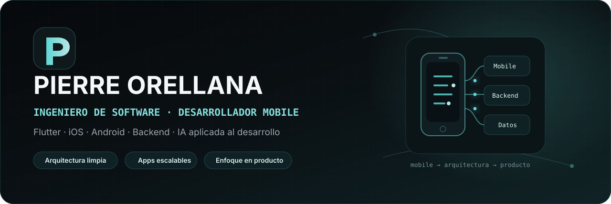

 

---

## 👋 Sobre mí

Soy **Pierre Orellana**, Ingeniero en Software y desarrollador enfocado en crear **productos móviles modernos, mantenibles y listos para crecer**.

Mi especialidad principal es **Flutter**, complementada con experiencia en **iOS nativo, Android nativo, backend e integración de servicios**. Me interesa especialmente el punto donde se cruzan la arquitectura, la experiencia de usuario y la calidad técnica.

~~~dart
final pierre = {
  'especialidad': 'Desarrollo Mobile',
  'mobile': ['Flutter', 'SwiftUI', 'Kotlin'],
  'backend': ['.NET', 'Node.js', 'FastAPI'],
  'enfoque': ['Clean Architecture', 'SOLID', 'Producto', 'Calidad'],
  'intereses': ['IA aplicada', 'Agentes', 'SDD', 'Engineering Harnesses'],
};
~~~

> Mi objetivo no es solamente hacer que una app funcione, sino construirla de forma que siga siendo clara, segura y mantenible cuando el producto crezca.

---

## 🧭 En qué me enfoco

<table>
<tr>
<td width="33%" valign="top">

### 📱 Mobile
Aplicaciones multiplataforma y nativas con foco en rendimiento, experiencia de usuario y consistencia visual.

</td>
<td width="33%" valign="top">

### 🏗️ Arquitectura
Separación por responsabilidades, Clean Architecture, SOLID, modularización y código testeable.

</td>
<td width="33%" valign="top">

### 🔐 Producto real
Biometría, sesiones seguras, resiliencia de red, APIs, persistencia y flujos pensados para producción.

</td>
</tr>
</table>

---

## 🛠️ Stack tecnológico

### Mobile

### Backend

### Datos, nube y herramientas

---

## 🌟 Proyectos destacados

<table>
<tr>
<td width="50%" valign="top">

### 🏦 [BInova Mobile](https://github.com/pierorellana/binova_app)

Experiencia bancaria mobile construida con Flutter, con autenticación, biometría, productos, operaciones, tarjetas virtuales, estados degradados y una arquitectura pensada para mantenimiento y escalabilidad.

**Flutter · Provider · Clean Architecture · Firebase · Biométricos**

</td>
<td width="50%" valign="top">

### 🚌 [yeGamo](https://github.com/pierorellana/yeGamo_proyect)

Producto de movilidad urbana orientado a mejorar la visibilidad del transporte público, rutas y experiencia de viaje desde una interfaz mobile moderna.

**Flutter · Mapas · UX/UI · Producto · Tiempo real**

</td>
</tr>

<tr>
<td width="50%" valign="top">

### 🍎 [MoviApp iOS](https://github.com/pierorellana/moviapp_prueba_tecnica_ios)

Aplicación iOS nativa con autenticación biométrica, consumo REST, filtros, paginación, persistencia local, asincronía moderna y arquitectura basada en MVVM.

**SwiftUI · MVVM · Core Data · async/await · LocalAuthentication**

</td>
<td width="50%" valign="top">

### 🚘 [Control de acceso vehicular](https://github.com/pierorellana/tesis_app)

Prototipo móvil para validar visitantes mediante QR, OCR, reconocimiento facial, lectura de placas y comunicación automatizada.

**Flutter · FastAPI · PostgreSQL · OCR · Reconocimiento facial**

</td>
</tr>

<tr>
<td width="50%" valign="top">

### 🤖 [Fraudia AI](https://github.com/pierorellana/backend-fraudia)

Backend para análisis antifraude con scoring explicable, reglas, alertas, analítica y asistencia conversacional con IA.

**FastAPI · PostgreSQL · Ollama · IA aplicada**

</td>
<td width="50%" valign="top">

### 🔗 [BInova API](https://github.com/pierorellana/api_binova)

Backend de soporte para los flujos del proyecto bancario, pensado como contraparte real de la aplicación móvil y sus operaciones.

**API · Integración · Backend · Servicios para Mobile**

</td>
</tr>
</table>

---

## 📊 Actividad en GitHub

---

## 🐍 Flujo de contribuciones

<picture>
  <source media="(prefers-color-scheme: dark)" srcset="https://raw.githubusercontent.com/pierorellana/pierorellana/output/github-contribution-grid-snake-dark.svg" />
  <source media="(prefers-color-scheme: light)" srcset="https://raw.githubusercontent.com/pierorellana/pierorellana/output/github-contribution-grid-snake.svg" />
  
</picture>

---

## 🤝 Conecta conmigo

 

### Código claro. Producto sólido. Mejora continua.

Mobile · Arquitectura · Backend · IA aplicada al desarrollo

